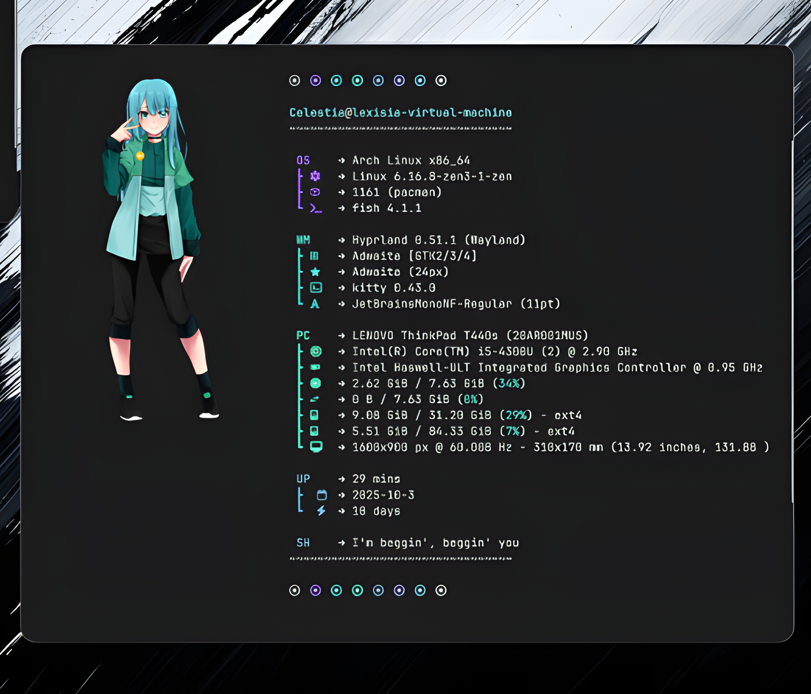
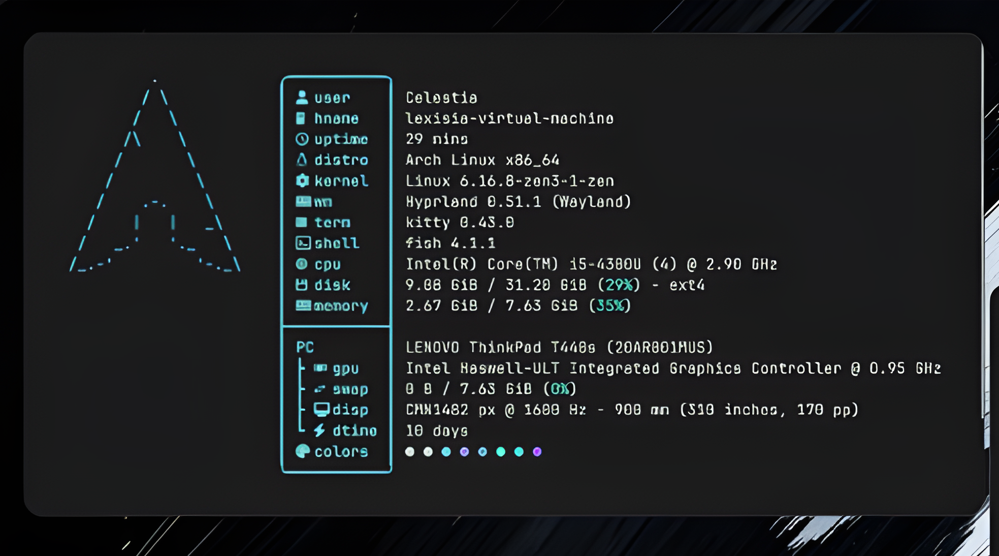

# Overview
A lightweight ASCII art, terminal greetings, polished-personalized configuration bundle for **fastfetch** and **fish shell**.
<p align="center">
 
</p>

# Dependencies
**Before cloning the git repository, make sure to have the following dependencies installed on the system.**
- [fastfetch](https://github.com/fastfetch-cli/fastfetch)
- [fish shell](https://github.com/fish-shell/fish-shell)
- [ImageMagick](https://github.com/ImageMagick/ImageMagick) (for ```.png``` image display - Mendatory)

# Installation
Clone the repository to your configuration directory:

```
 git clone https://github.com/Namelessmode/FastFish.git ~/.config/FastFish
```
> Note: If you have your own configs for fish or fastfetch, make sure to either delete or back things up before cloning.
```
cp -r ~/.config/fastfetch ~/.config/fastfetch.backup && cp -r ~/.config/fish ~/.config/fish.backup
```
# Usage
- fastfetch

Move the following fastfetch config to the destined directory:

```
#Move
mv ~/.config/FastFish/fastfetch ~/.config/fastfetch
```
Or use symlink to avoid overwriting existing configs
```
#Symlink
ln -s ~/.config/FastFish/fastfetch ~/.config/fastfetch
```
Preview
<p align="center">
 
</p>

 > _To display images in `*.png` format, set_:

```
sudo pacman -Syu imagemagick
```

---
- fish

Move or Symlink the following fish config to the destined directory:
```
#Move
mv ~/.config/FastFish/fish ~/.config/fish
```
```
#Symlink
ln -s ~/.config/FastFish/fish ~/.config/fish
```

After moving or symlinking the configuration file to the destination (~/.config/fish/), activate the greeting function:

```
source ~/.config/fish/functions/fish_greeting.fish
```
Preview
<p align="center">
 
</p>

# Credit
Inspiration and references taken from:
- [mylinux4work/dotfiles](https://github.com/mylinuxforwork/dotfiles)
- [HyDE-Project/HyDE](https://github.com/HyDE-Project/HyDE)
- [LierB/fastfetch](https://github.com/LierB/fastfetch)
- [sofijacom/dotfiles-fastfetch](https://github.com/sofijacom/dotfiles-fastfetch)
